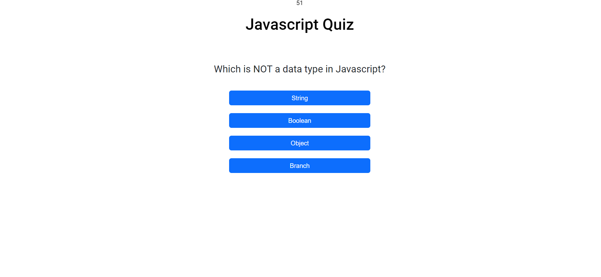

# JavaScript Quiz

## Description
A quiz on javascript that tests basic knowledge of javascript terms and functionality. This quiz was built with HTML, CSS, Javascript, Bootstrap, and Jquery.

## Installation

N/A

## Usage
To use this application, the user will click on the start button. When the user clicks this button the quiz will start along with a timer set at 60 seconds. Upon selecting the correct answer to a question, your correct answers score will increase by 1. If guessing the question wrong, 10 seconds will be removed from the timer and your incorrect score will increase by 1. The game ends once all questions are answered or the timer reaches 0.

## Link to deployed Site
https://kodacaleb.github.io/Javascript-Quiz/

## link to github Repo
https://github.com/KodaCaleb/Javascript-Quiz

## Screenshot

## Credits
N/A

## License

Please refer to LICENSE in repo
